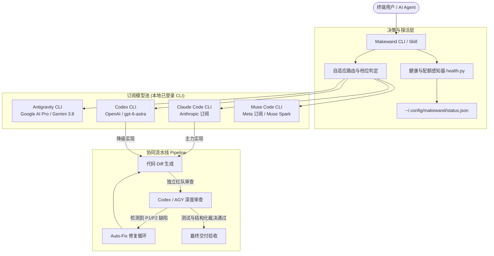

# Makewand (魔杖) v3.2.0

> **多模型编程订阅联合调度与红队自愈体系** (Unified Multi-Model Subscription Orchestrator)  
> 官方网站：[https://makewand.org](https://makewand.org) · 备用镜像：[https://makewand.com](https://makewand.com)  
> 统合调用本机 **Antigravity (Google AI Pro)**、**Claude Code**、**Codex CLI (OpenAI)**、**Grok Build**、**Muse Code** 与其他已配置工具，提供订阅优先调度、显式付费 API 策略、跨模型审查、自愈回环与候选比较。

```bash
# 🚀 官方一键快速安装
curl -fsSL https://makewand.org/install.sh | bash
```

---

## 🌟 核心特性 (Key Features)

- **🌐 官方网站与文档中心**：托管于 Cloudflare Pages 全球边缘网络（[makewand.org](https://makewand.org) / [makewand.com](https://makewand.com)），提供交互式终端模拟器与完整手册。
- **🔌 全生态工具自适应拓扑**：根据已安装工具、显式启用配置和健康缓存选择实现与审查引擎。只有一个工具时使用单独的只读复审调用，仍需测试及有效裁决。
- **💰 明确的 API 费用策略**：默认 `subscription_only`，禁止 Makewand 直接调用云 API，即使环境中已有 API key 也不会自动转为付费回退。设置 `MAKEWAND_API_POLICY=allow_paid` 或配置 `"api_policy": "allow_paid"` 才允许按量计费的 API 与回退；`makewand status` 展示当前策略。官方 CLI 自身的计费模式、订阅配额和本机资源消耗仍由相应工具及配置决定。
- **⚡ 额度感知与自适应降级 (Quota-Aware Routing)**：
  - Python 状态看板使用缓存、本地调用估算和 CLI 报告，不将估算当成官方剩余额度；Go `quota` 提供支持工具的官方额度读取。
  - 在已启用且可用的候选引擎间回退；额度、认证或审查失败可能阻止交付。
- **🛡️ 跨模型独立红队审查 (Cross-Model Review)**：
  - 审查在只读沙箱中运行，优先采用与实现者不同的引擎。
  - 审查必须给出结构化 `MAKEWAND_VERDICT`，并与经过测试的具体产物绑定。
- **🔄 自愈修复闭环 (Auto-Fix Loop)**：
  - 审查若发现 `[P1]`（高危）、`[P2]`（中危）、死锁或竞态缺陷，在配置的修复次数和时间预算内重派实现及复审；测试失败、裁决缺失或产物改变会阻止交付。
- **🏁 双模型并发隔离竞速 (Race Mode)**：
  - `makewand race "<任务>"` 在临时隔离沙箱中并行派发两组模型，统计耗时与代码质量，由可用裁判输出结构化采纳裁决。默认保留 A/B 候选，显式 `merge` 才生成混合候选 M。
- **🌲 非 Git 目录弹性容灾**：未初始化 Git 的工程自动构建轻量级影子跟踪树，彻底解决常规工具依赖 Git 导致的崩溃。
- **🚀 无头执行与跨平台沙箱约束**：写入任务在必需的 Bubblewrap (bwrap) 沙箱内运行官方 CLI；沙箱不可用时遵循 fail-closed 拒绝执行。bwrap 沙箱依赖 Linux 内核命名空间，macOS 支持开箱即用的只读分析与审查（`makewand review`）；在 macOS 上运行代码生成写入任务时，建议通过 Linux 容器/VM 或远端执行器（`--remote-url`）运行，或显式配置 `MAKEWAND_UNSAFE_HOST_EXEC=1` 并完成交互确认授权宿主执行（所有宿主执行将审计至 `unsafe_exec_audit.jsonl`）。Go 的 Strength1 候选仍需人工确认。
- **📡 实时流式输出**：支持 `--stream` 参数，带模型专属色彩前缀逐行流式呈现。

---

## 🏗️ 架构拓扑 (Architecture)



---

## 📦 安装与配置 (Installation)

### 快速安装
```bash
cd path/to/makewand
./scripts/install.sh
```
源码安装需要 Git、Python 3.9+ 和 `go.mod` 指定的 Go 工具链。安装器冻结 Go/Python 构建输入，在独立版本目录中编译、检查版本及公共命令，然后原子切换 `current` 与 `~/.local/bin/makewand`。失败保留原安装，并保留 `previous` 供回退；同时建立兼容的 `trio` 软链接。

预编译 Release、Homebrew 和 Scoop 安装包含 Go CLI 与同版本 Python 引擎；运行时需要 Python 3.9+。手动解包时须将整个目录一起安装，保留二进制旁的 `lib/`。Homebrew/Scoop 会声明 Python 依赖。供应商 CLI 与项目测试工具需要单独安装；Makewand Python 引擎本身仅使用标准库。

供应商启停策略对 Go/Python 入口共同生效，禁用也阻止该工具的探测和额度读取。Claude、Gemini 和 OpenAI 的 API 参数按环境变量、`api_keys.json`、`config.json`、默认值的顺序读取；付费调用仍需显式启用 `allow_paid`。详见[共享配置契约](docs/EXECUTION_CONTRACT.md#shared-provider-configuration)。

`MAKEWAND_QUOTA_RESERVE_PERCENT` 设置官方剩余额度的保留阈值，默认 `8`（百分比）；例如仅对一次命令设置 `MAKEWAND_QUOTA_RESERVE_PERCENT=4 makewand ...`。只接受有限数值 `0`–`100`，低于阈值时阻止自动派发；`0` 也不会放行已耗尽额度。无效设置会显示警告并回退到 `8`，不会清除实际限流或认证失败；账号关联及官方数据有效期仍照常校验。显式设置时，Codex 精确的剩余百分比使用同一阈值；模糊的低额度警告只有新鲜、同账号官方证据确认足够时才放行，真实限流仍优先。该设置不增加订阅额度，也不启用付费 API。

---

## 💻 命令行用法速查 (CLI Reference)

### 1. 订阅健康状态与额度看板
```bash
# 查看健康缓存与额度来源（不会主动调用模型）
makewand status
makewand quota

# 显式发起探活（部分工具消耗真实订阅调用）
makewand probe
```

### 2. 动态模型发现
```bash
# 自动探测系统配置文件中记录的最新模型版本
makewand models
```

### 3. 全自动联合编码流水线
```bash
# 执行端到端实现 + 跨模型审计 + 自愈回环
makewand run "在当前目录编写一个支持重试与指数退避的 HTTP 请求客户端"

# 指定工作目录并启用实时流式输出
makewand run "重构用户认证模块" --cwd /path/to/repo --stream

# 指定推理档位 (fast / standard / deep)
makewand run "排查并发线程安全" --tier deep

# 保持已有验收测试的内容与权限；任务在隔离工作树完成
makewand run "修复解析器" --protect tests/test_parser.py
```

`--protect` 可重复指定相对路径，也适用于 `race` 和 `apply`。成功的受保护流水线提供带校验的 `apply_delivery.sh`；候选应用的 `--force` 不能绕过文件保护。详见 [执行约定](docs/EXECUTION_CONTRACT.md#protected-task-files)。

### 4. 独立代码审查
```bash
# 针对当前目录未提交的 git diff 实施红队安全审查
makewand review
```

### 5. 双模型并发竞速模式
```bash
# 两位选手并行实现，由可用裁判评审；工作区保留候选供检查
makewand race "实现一个快速排序函数 quick_sort(arr) 并写测试用例验证"
makewand inspect <race-id> --candidate A
makewand apply <race-id> --candidate A

# 可选混合候选：完整三方合并、测试、独立复审，然后应用
makewand merge <race-id>
makewand review --race-id <race-id> --candidate M
makewand apply <race-id> --candidate M
```

### 6. 带预算安全搜索 (避免冷归档与大库 I/O 卡死)
```bash
makewand search "def safe_search" --cwd /path/to/project
```

### 7. Bubblewrap 物理进程沙箱隔离执行
```bash
# 隔离运行单元测试 (只读根目录、凭据自动脱敏、仅工作区可写)
makewand sandbox python3 -m pytest tests/

# 阻断外网访问执行构建/测试
makewand sandbox --no-net go test ./...
```
> **跨平台隔离说明**：Bubblewrap 物理沙箱依赖 Linux 内核命名空间。macOS 环境下，只读审查（`makewand review`）开箱即用；对于代码生成与写入任务，系统遵循 fail-closed 拦截，并给出清晰指引（容器/远端运行，或显式 `MAKEWAND_UNSAFE_HOST_EXEC=1` 确认授权与审计记录）。

### 8. 单模型直接透传调用
```bash
makewand agy "总结当前项目的架构优势"
makewand codex "分析这段代码的死锁风险"
makewand claude "编写测试用例"
makewand muse "检查系统配置项"
```

### 9. 统一模式定义与跨语言契约 (Unified Modes & Tiers Contract)

Makewand 在 Python（`orchestrator` / CLI / REPL）与 Go（`router` / TUI / 守护进程）之间保证双向无缝映射与透明别名支持：

| Go Usage Mode | Python Tier | 档位定位与适用场景 |
|:---:|:---:|---|
| `fast` | `fast` | 极速响应、低延迟，适合单测生成与简单语法补齐 |
| `balanced` | `standard` | 均衡平衡档（默认），适合常规编码重构与流水线执行 |
| `power` | `deep` | 深度推理、最大思考步数（High Effort），适合复杂并发、架构解耦与深度审计 |

- **跨语言参数对齐**：命令行支持 `--mode` 与 `--tier` 互为别名，无论传入 `fast`、`balanced`、`power` 还是 `fast`、`standard`、`deep`，系统均能自适应双向转换与持久化配置。

### 调用与资源预算

```bash
makewand run "修复边界用例" --max-model-calls 3 --call-budget-file /tmp/task-budget.json
makewand run "修复局部边界" --workflow single --risk low --total-timeout 180 --max-model-calls 2
makewand race "比较两种实现" --total-timeout 180 --judge-reserve-seconds 45 --max-model-calls 3
MAKEWAND_CANDIDATES=1 MAKEWAND_CANDIDATE_CONCURRENCY=1 makewand new
```

Go 原生调用、Python 流水线、直接工具命令、比赛裁判及真实模型探活共享调用账本，失败和裁决补问也占一次。`--call-budget-file` 让多个进程共享上限；只指定 `--max-model-calls` 时，入口创建本次任务的独立账本。账本的最大值只能降低，已开始的调用不退还额度。发送后无法确定结果时返回 `UNKNOWN`，停止自动切换提供者或重派。统计单位是 Makewand 派发尝试，无法限制供应商 CLI 内部工具轮次或代替 Token/费用计量。

`--workflow auto` 对风险未知的任务采用跨提供商流水线；明确的低风险任务可使用 `--workflow single --risk low`，仍需单独的只读审查和本地测试。`--risk high` 要求跨提供商验证，不足时返回未验证。Race 提前预留两次实现和一次裁判调用，并默认留出总期限的 25%（最多 60 秒）供裁判使用；资源不足会停止派发。混合候选仍通过显式 `merge` 和独立审查交付。

设置 `MAKEWAND_EXECUTION_EVENTS_FILE=/tmp/task-events.jsonl` 可记录准备、复制、生成、验证、审查和应用各阶段的时间、任务 ID、产物摘要及结果状态。日志不记录提示词、工作目录、原始错误或凭据，未测得的 Token、费用和内存保持 `null`。稳定状态码、跨语言契约及超时边界见[执行契约](docs/EXECUTION_CONTRACT.md)，固定 12 项评测与离线验收检查见[评测说明](benchmarks/README.md)。

Go 原生候选选择支持 1–3 的候选数与并发上限，以及 `MAKEWAND_CANDIDATE_TIMEOUT=2m` 和 `MAKEWAND_CANDIDATE_BUDGET_USD=0.5`。正数美元预算自动启用串行候选，并根据已报告成本停止后续调用；它是每次选择的软阈值，不能限制未知订阅成本或单次超额。超时通过 context 协作取消，不能撤销已发生的远端调用。资源设置不改变 Strength1 候选仍须人工确认的门槛。

Go 工作区复制默认仅在 Linux 的源目录与临时目录位于同一 Btrfs/XFS 文件系统时尝试写时复制；reflink 不可用或尝试失败时完整回退到普通复制，普通复制错误会中止候选工作区创建。`MAKEWAND_WORKSPACE_REFLINK=0` 强制普通复制，`=1` 可在其他文件系统显式尝试。候选输入始终使用独立文件，不使用硬链接共享可写内容；实际性能取决于文件系统和文件大小。配置与 Windows 身份边界见[验证契约](docs/VERIFICATION_CONTRACT.md#go-candidate-resources-and-workspace-copies)。

### 10. 可选 Unix daemon 派发

```bash
makewand daemon start
makewand status --daemon --json
makewand daemon stop
```

Daemon 为每次请求启动独立 Python worker，使用相同的 CLI 参数解析器，并保留调用目录、参数、标准输入和客户端环境快照。`MAKEWAND_API_POLICY` 等执行策略按请求生效；任务不会继承 daemon 启动时的旧策略。独立进程防止并发请求串目录或串输出，仓库写入仍受工作区锁、沙箱和交付校验约束。

此实现包含每次 worker 的启动时间，不承诺 `<15ms` 执行延迟。使用 `--no-daemon` 可直接执行。协议不兼容时需重启 daemon；执行请求发送后若失去最终结果，客户端返回错误并停止自动重试。断连、超时或取消会终止请求关联的本机进程树，不能撤销已经发生的文件修改或远端模型请求。

默认最多 4 个任务和 12 个连接并发，请求限 1 MiB、输出限 16 MiB；IPC 期限默认 600 秒，上限 3600 秒。请求结果在当前 daemon 内保留一小时、最多 4096 条，重启后不再可查询。完整协议、结果查询及取消边界见 [验证契约](docs/VERIFICATION_CONTRACT.md#python-daemon-execution-contract)。

---

## 🤖 主流 AI 协同接入 (AI Integrations)

Makewand 原生设计为不仅面向人类终端开发者，更作为所有 AI 代理的“外挂魔杖”：
- **Antigravity (AGY)**：内置 `makewand-orchestrator` Skill，在处理复杂架构任务时自主调用。
- **Claude Code**：在 `CLAUDE.md` 中指引调用 `makewand review` 实现外部交叉审计。
- **Codex CLI**：在 `default.rules` 中支持调度 `makewand race` 与 `makewand run`。
- **Muse Code**：支持在 Meta 生态中联动调度其它模型。

详细指引见 [integrations/](integrations/) 目录。

---

## 🧪 自动化测试 (Testing)

```bash
make test
# 或
python3 -m unittest discover tests
```
