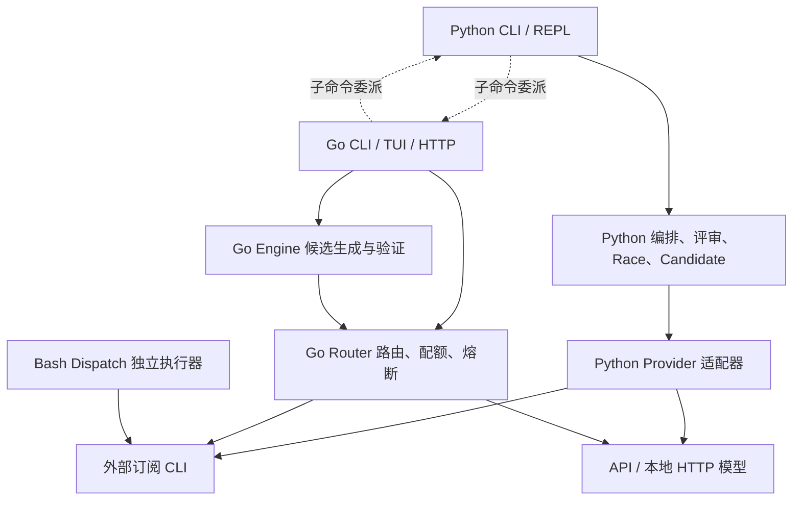

# makewand 技术评估与架构评审

**评审日期：2026-09-27｜代码快照：`ccfd8b47755e3da6b738814b45513208c80babc1`｜综合评分：62 / 100**

**裁决：这是一个实现密度较高、具有实用价值的单机多模型开发工具；服务端仍应定位为 Alpha。当前证据不足以支持“恶意仓库安全执行平台”“强隔离多租户服务”或“测试通过即保证安全交付”的定位。** 最需要修复的是验证对象与交付对象不一致、测试门禁可被绕过、文件写入边界及宿主 Git 执行边界。增加模型数量或继续调整路由权重，应排在这些工作之后。

## 评审范围、方法与证据边界

本次清点了版本控制中的实现、测试、CI、安装与基准脚本，深入追踪 Python 编排、Go 路由/候选验证/服务入口和 Bash Dispatch 三条执行路径。重点阅读了用户指定模块，并核查了 TUI 文件交付、服务鉴权、预算、远程会话等关联实现。未以已有评审文档中的结论作为证据；未修改实现代码。

证据分为三类：**实测**表示执行过现有测试或临时复现；**静态确认**表示控制流直接支持结论；**条件性风险**表示只有满足明确前提才可能产生危害。这里的安全等级是本项目威胁模型下的工程优先级，不是 CVSS 分数。没有调用真实商业模型、消耗真实订阅额度、读取真实凭据或攻击宿主服务；不声称完成形式化验证、生产负载测试或每种 Provider 的在线兼容性认证。

环境：Python 3.12.3、Go 1.27.1、Git 2.55.0、Bubblewrap 0.9.0，Linux；Bubblewrap 实际可用。`go.mod` 要求 Go 1.26.0。按跟踪文件清点：Python 实现 27 文件 / 10,307 行，Go 实现 124 文件 / 40,746 行，Shell 实现 22 文件 / 2,267 行；Python 测试 20 文件 / 5,111 行，Go 测试 127 文件 / 26,153 行。行数说明维护规模，不代表质量。

## 优先级最高的发现

| 编号 | 等级与证据 | 发现 | 影响与前提 |
|---|---|---|---|
| F01 | 高，实测 | Go 返回 `Verified=true / Strength=2`，交付内容却无法编译 | 验证克隆恢复了原测试，交付仍采用候选原始内容；无需并发竞争 |
| F02 | 高，实测 | 新增 Go `TestMain` 可让错误实现获得 Strength 2 | 原项目存在可信测试，候选新增入口提前 `os.Exit(0)`，原测试未执行 |
| F03 | 高，受控竞态复现 | Python 候选应用可以写出工作区 | 另一个可写工作区的进程在路径检查后替换父目录；全局 flock 无法约束它 |
| F04 | 高，实测 | Go `WriteFile` 沿硬链接修改工作区外文件 | 原工作区文件已经与外部文件共享 inode；路径本身完全合法 |
| F05 | 高，实测 | Python linked worktree 和 Go GitCommit 仍能触发宿主 clean filter | 存在相关 Git filter 配置和 `info/attributes`；并非普通远程 clone 自动满足此前提 |
| F06 | 高，条件性危害；通道实测 | 只读挂载及禁止网络仍允许连接可见的 pathname Unix socket | 挂载树内存在当前 UID 可连接的宿主 socket；最终危害取决于服务暴露的能力 |

这些发现与全量测试通过同时成立。全绿说明已有测试预期被满足，不能推导安全边界不存在缺口。

## 1. 宏观架构与跨语言契约

### 1.1 实际上存在三条策略执行路径



Python 承担任务分类、编码—评审—修复闭环、额度步调、候选留存和交互入口；Go 承担常驻服务、HTTP、TUI、鉴权、账本、路由，并且也实现自己的候选生成和验证。因此它们不是一套调度算法的两种语言封装，而是**两套各自完整、部分重叠的控制逻辑**。Dispatch 还维护第三套超时、内存限制和工具调用策略。

分工的合理之处在于：Python 易于适配 CLI 和迭代工作流；Go 适合常驻请求、并发状态和可复用 Router。`internal/model` 通过类型别名桥接 Router，减少配置/TUI 对底层实现的直接依赖。Go Provider interface、实例级注册、模型表和热重载提供了较好的扩展基础。[Provider 接口](/path/to/workspace/makewand/router/router.go:128)、[注册机制](/path/to/workspace/makewand/router/provider_registry.go:12)。

Go 服务侧也已有值得保留的工程基础：默认 loopback 监听、非 loopback 明示开关、scoped Bearer、会话按身份/组织/项目约束、管理会话签名与 CSRF 检查、Argon2id 密码哈希、注册限流和哈希并发限制，以及 HTTP body/连接超时。这些措施提高了受控小团队场景的可用性；它们与执行工作区的内核隔离是不同层面的保障。[服务入口](/path/to/workspace/makewand/cmd/makewand/serve.go:62)、[管理会话](/path/to/workspace/makewand/serveradmin/session.go:190)、[密码哈希](/path/to/workspace/makewand/router/users.go:373)。

### 1.2 当前契约主要停留在命令与名称层

Python 根据 `sys.argv[1]` 委派 `serve/chat/new/...`；Go 根据 `args[0]` 委派 `run/review/race/...`。两侧通过子进程标准输入输出和退出码交接，并没有一个带版本的跨语言任务协议。[Python 委派](/path/to/workspace/makewand/makewand/cli.py:465)、[Go 委派](/path/to/workspace/makewand/cmd/makewand/main.go:76)。

`fast/standard/deep` 与 `fast/balanced/power` 的映射明确，但这只保证名称转换，不能保证候选数量、验证强度、付费回退、网络权限和取消行为一致。[模式契约](/path/to/workspace/makewand/internal/engine/mode_contract.go:1)。Python 没有编译产物时退到 `go run`，会把 cwd 切至 makewand 源码根目录；依赖调用者当前目录的相对项目路径因此存在语义变化。首参数分流也应补全“全局选项在子命令前”的契约测试。

服务端 HTTP completion、Go TUI candidate autopilot、Python pipeline、Python race 的“成功”含义不同。尤其 HTTP 返回模型响应，并不等于经过 Engine 候选验证。所谓 OAuth 主要体现为使用已有 CLI OAuth 凭据读取额度；服务自身主要是 Bearer/scoped token 与签名管理会话，不宜把它描述为完整 OAuth 授权服务器。

### 1.3 新增 Provider 与执行模式的成本

| 扩展 | 现状 | 主要欠缺 |
|---|---|---|
| Go Provider | 接口与工厂清楚，可独立增加实现 | 仍须补模型能力、访问类型、价格/用量、信任声明、流式协议及取消测试 |
| Python Provider | 各 CLI 有独立适配文件 | dispatch 分支、发现、健康检查、评分、额度、沙箱凭据挂载分散，需要多处同步 |
| 新执行模式 | 已有名称归一化 | 两侧工作流、安全策略、CLI/TUI/HTTP 参数需分别修改，缺少统一配置模型 |
| API / 本地模型作为 coder | 可返回文本 | Python 没有通用文件编辑/工具循环；`cwd` 不会自动让纯 HTTP 模型获得工作区操作能力 |

静态确认：Cursor/Copilot 出现在支持/发现配置中，但 `dispatch_task` 没有相应执行分支；“能发现”不等于“能完成编码任务”。API 回退返回成功文本后，Python pipeline 仍要求磁盘有 diff，可能直接进入空改动失败，而不是继续寻找可操作工作区的 coder。[dispatch](/path/to/workspace/makewand/makewand/orchestrator.py:608)、[Provider 列表](/path/to/workspace/makewand/makewand/config.py:246)。

建议先建立 `ProviderCapabilities`（chat、workspace_write、readonly_tools、structured_usage、cancel、untrusted_safe），据能力选择执行路径；把 Provider 名称和能力判断解耦。

## 2. 多模型调度与额度步调的数学评价

### 2.1 Δ 控制器的实现是清楚的启发式反馈

令剩余额度比例为 `q`，估计周期为 `T`，距离重置时间为 `r`：

$$c=\operatorname{clamp}(1-q),\quad e=\operatorname{clamp}(1-r/T),\quad \Delta=c-e.$$

在理想的固定周期、可信额度观测下，Δ 表示实际消耗相对均匀消耗进度的偏差。这是有意义的无量纲指标。实际分支如下：[pacing.py](/path/to/workspace/makewand/makewand/pacing.py:133)。

| 条件 | 决策 | 路由分数调整 |
|---|---|---:|
| 一般 Provider 被限流/失效或额度为 0 | fast / low；避让 | -999 |
| 没有可解析的重置锚点 | standard / high | 0 |
| 周期最后 12%，剩余额度 ≥15% | harvest：deep / max | +3.0 |
| Δ < -0.15 | deep / high | +2.2 |
| Δ > +0.15 | fast / low | -2.0 |
| 其余 | standard / medium | 0 |

例如剩余 80%、周期已过 60%，Δ=-0.4，升档符合“利用将过期额度”的目标；剩余 20%、周期仅过 30%，Δ=0.5，降档合理。但这不是经证明的最优运筹解：它没有未来需求预测、任务价值函数、模型质量/时延曲线、额度不确定性或执行中预留。

精度首先受观测限制。Python 的额度主要来自状态文本、调用次数和加权用量推估；`calculate_provider_quota` 甚至把惩罚区间映射为 5/20/40/65 等百分比。对这些估计再应用精细时间公式，不会产生真实的额度精度。[配额推算](/path/to/workspace/makewand/makewand/health.py:455)。

### 2.2 已确认的控制器缺陷

1. **AGY/local 特例早于硬限制分支。** 即使 AGY 为 limited，pacing 仍输出 balanced、额度 100%；临时复现确认。外层路由和 Provider 仍有状态检查，因此不能把它扩大为“所有硬限制都可绕过”，但控制器本身语义错误。
2. **相对重置时间不会老化。** 缓存中的 `in 2 hours` 每次被解释为新的 7200 秒，没有扣除 `updated_at` 以来的时间；ISO 时区偏移和括号内时区也未正确保留。过期绝对时间被压至 0，陈旧健康记录可能持续进入 harvest。[时间解析](/path/to/workspace/makewand/makewand/pacing.py:48)。
3. **固定周期混淆不同窗口。** Claude/Codex 默认 7 天，若解析的是小时级重置锚点，可能错误地认为已经处于周周期末段。短窗口、日窗口、周窗口应分别建模。
4. **“hysteresis”名不副实。** Python penalty 没有历史状态，只是一段无状态缓冲曲线；warn 左侧趋于半个 warn penalty，达到 warn 时跳到完整 penalty，仍有阶跃。Go 的 band 支持 sealed 参数，但当前生产调用传入 false，未形成所声称的有记忆迟滞。[Python penalty](/path/to/workspace/makewand/makewand/usage.py:260)、[Go 调用](/path/to/workspace/makewand/router/quota_gate.go:39)。
5. **入口功能缺陷。** `run_pipeline(boost=True)` 实测抛出 `NameError: COLOR_MAGENTA`；local 健康探针将三元素 tuple 当 bool，`(False,"",[])` 也被判 healthy。执行适配器仍可能正确失败，但健康展示与路由受到污染。[boost](/path/to/workspace/makewand/makewand/orchestrator.py:1028)、[local 探针](/path/to/workspace/makewand/makewand/health.py:279)。

自动档才充分服从推荐 tier；显式 tier 会保留，发现到的 effort 默认值也可能覆盖 pacing effort。报告和 UI 应说明这是一组优先级规则，不应让用户以为调度器总能强制降档。

### 2.3 Go Router 的自适应机制更完整，但质量信号仍有限

Go 排序先按访问类型：subscription → free → local → API；再结合失败率、额度分档、冷启动顺序和 Thompson Sampling。Beta 后验根据阶段/Provider 的成功失败积累，并用静态偏好作为先验。这比单纯固定分数更有扩展潜力。[策略](/path/to/workspace/makewand/router/strategy.go:201)。

限制包括：质量标签来自测试或裁判；裁判偏差及 F01/F02 会污染学习；状态按 phase/provider 聚合，不能区分模型升级、任务难度与推理档位；缺少明显的时间衰减。失败率 >50% 的相关代码实际是排序靠后，注释中的“hard-exclude”不等于真的剔除。访问类型排序还会先于这些质量因素。

独立 circuit breaker 则有真实 closed/open/half-open 状态、默认三次失败和 30 秒冷却，以及单次试探并发限制；这部分值得肯定。QuotaSnapshotter 使用原子快照和刷新互斥；Claude OAuth 用量及 Codex 会话限额比纯次数估算更接近实际观测，AGY 仍主要只有认证状态。[熔断器](/path/to/workspace/makewand/router/circuit_breaker.go:1)、[额度来源](/path/to/workspace/makewand/router/quota.go:601)。

## 3. 多模型审查、测试否决权与 Race Mode

### 3.1 审查闭环有价值，但盲审并不产生独立性保证

Python pipeline 的 coder/reviewer 分离、空评审失败、结构化最终 verdict、缺陷优先、有限修复次数，以及最终 `test_ok` 再检查，都是实质性的质量措施。最终测试失败确实能够否决口头 LGTM。[最终门禁](/path/to/workspace/makewand/makewand/orchestrator.py:1534)。

但“消除幻觉”不是可支持的结论。别名不同不保证基础模型不同；模型共享训练分布、任务描述和可能带提示注入的仓库内容。单工具模式是一次新的只读自审调用，仍共享模型偏差和工作区，不自动获得独立评判者。部分修复后的兜底分支也会回到 coder 自审。

形式上，错误交付概率取决于：

$$P(E_{ship})=P(E_{code})\,P(A_{review}\land A_{tests}\mid E_{code}).$$

不能在没有独立性证据时，把几个模型的错误率直接相乘。长 diff 截断、纯文本肯定句兼容、裁判自然语言解析，都让评审成为有用的启发式信号，而不是安全证明。

### 3.2 F01：测试通过的树不是最终交付的树

Go `EvaluateCandidateFiles` 为保留可信测试，过滤候选对原测试文件的覆盖，并恢复 baseline 的 npm test script。这个动机正确；但返回的是验证报告，未把经过过滤后的内容作为交付产物。`RunCandidateSelection` 返回的 `Content` 仍是原候选内容。[验证过滤](/path/to/workspace/makewand/internal/engine/workspace_verify.go:386)、[返回原内容](/path/to/workspace/makewand/internal/engine/candidate_service.go:302)。TUI 随后从这些内容提取文件并写入。[交付写入](/path/to/workspace/makewand/internal/tui/app_build_flow.go:247)。

**实测：** baseline 有正确的 `Add` 测试；候选带正确业务代码，但把原测试文件改成无法编译的 Go。验证克隆保留原测试，结果 `Verified=true, Strength=2`；将选择结果交付到工作区后再运行测试，退出码为 1。此次复现通过 Go overlay 注入临时测试，未修改仓库。

**影响：** Verified 不能证明接下来写入的字节被验证过；自动交付建立在错误的证明对象上。

**修复与验收：** 将最终候选树封存为不可变 digest；可信测试评估与最终交付树完整验证分别进行；只交付同一 digest。若禁止候选改原测试，就应明确拒绝或在产物中移除该改动，而不能只在验证时静默恢复。必须增加“验证成功但最终产物编译失败”的负例回归。

### 3.3 F02：baseline 测试存在，不代表它执行过

Go 当前允许新增测试文件。新增 `bypass_test.go`，通过 `TestMain` 提前 `os.Exit(0)`，可以跳过原测试；检测器从外层成功输出推断没有发生空测试。[新测试允许写入](/path/to/workspace/makewand/internal/engine/workspace_verify.go:419)、[Strength 判断](/path/to/workspace/makewand/internal/engine/workspace_verify.go:895)。

**实测：** 把 `Add` 改成恒返回 0，加入上述入口后，得到 `Passed=true, Strength=2, BaselineTests=true, NoTestsRan=false, Isolated=true`。这是实际在 Bubblewrap 中运行的测试，说明隔离成功与语义验证成功是不同命题。

**修复与验收：** 固定可信 harness 与测试清单，核对 baseline 测试实际执行的事件/数量；新增 `TestMain`、`conftest.py`、测试启动配置应触发策略审查或降级为未验证。对高风险生成内容增加进程外契约测试。仅禁止一个文件名仍不够，候选代码本身也可能退出进程或干扰 harness。

### 3.4 Python 门禁的上限更低

`run_local_tests` 在未找到测试时直接返回 `(True,None)`；Node 命令带 `--passWithNoTests`；测试及启动配置来自可写候选工作区。候选删除/削弱测试、测试执行中修改代码，都可能破坏“测试验证最终产物”的假设。[测试发现与执行](/path/to/workspace/makewand/makewand/orchestrator.py:257)。空目录复现确认为通过。

应统一采用 `failed / unverified / passed` 三态，并将“未发现测试”“工具不可用”“未实际执行测试”与通过分开。Go 已有 Strength 1/2 的设计方向，Python 应复用相同语义，而不是继续加布尔例外。

### 3.5 Python Race 是并发比较，不是完整的最先合格者竞速

优点：独立候选目录、相同任务和 tier、并发生成、分别测试、A/B 隐藏工具标签、候选留存和显式应用，均有实际实现。限制如下：[Race 主体](/path/to/workspace/makewand/makewand/orchestrator.py:1949)。

- 两份基线顺序复制；源工作区若在期间变化，A/B 可能不是同一起点。
- 默认等待双方结束，测试再串行执行；近似耗时为 `max(TA,TB)+TestA+TestB+Judge+Snapshot`，没有 Python 侧首个合格结果取消慢选手的收益。
- 主裁判固定为 AGY，可能与选手相同；还直接调用适配器，没有走统一 dispatch 的用户启用检查。因此不能称为严格对称、独立的双盲实验。
- 双方都合格但裁决不明确时按耗时选择，可能掩盖“两个方案都存在语义问题”的裁判意见；候选合格条件也未要求非空改动。
- **静态确认的退出码错误：** 双方测试失败时 winner=None，但只要有 coder 执行成功且 judge 调用成功，最后仍可能返回 `EXIT_PASSED`。apply 的测试门禁仍会阻止默认应用，但外部自动化已经收到错误成功信号。[胜者逻辑](/path/to/workspace/makewand/makewand/orchestrator.py:2111)、[最终退出](/path/to/workspace/makewand/makewand/orchestrator.py:2196)。

Go candidate selection 在首个 Strength 2 结果后取消其他工作，并继续收集已启动请求的用量，优于直接返回并丢失成本。这是好的竞速/结算设计；实际效果仍受验证真实性和取消完成时间约束。

## 4. 工作区、Git 与内核隔离

### 4.1 Bubblewrap 的基础配置有针对性

Python 使用 `--die-with-parent`、`--new-session`、IPC/UTS/PID 隔离、环境清空、只读根、临时 `/tmp`、遮蔽 `/run` 等路径和 HOME，再按需开放工具链/工作区；`.git` 尽量只读。对普通误操作和许多凭据路径泄漏有实际防御价值。[沙箱构造](/path/to/workspace/makewand/makewand/sandbox.py:123)。

但 Bubblewrap 是共享宿主内核的 namespace/mount 隔离，**不是物理隔离或虚拟机边界**。只读解决写入权限，不解决所有可读数据的保密性；根文件系统、其他共享挂载及工作区自身的秘密仍须独立考虑。当前 Python/Go bwrap 没有统一的 seccomp 与 cgroup 内存、CPU、PID 硬限制。

各路径的策略并不一致：Python 测试显式断网；Provider 通常需要联网且其认证目录多为可写 bind；Go 验证对 deps 和 tests 都允许网络；Go 原生 CLI Provider 在可信模式下运行于宿主，并声明不适用于不可信仓库。Go 对不可信 Provider 能力缺失采取拒绝策略，是有效优点，但不能把 Python 的外层 bwrap 保障迁移描述为 Go 全路径保障。[Go 网络策略](/path/to/workspace/makewand/internal/engine/sandbox.go:162)、[CLI 信任声明](/path/to/workspace/makewand/router/cli.go:327)。

### 4.2 F06：Unix socket 仍是重要的能力通道

**实测：** 在临时工作区创建 pathname AF_UNIX listener；通过实际 bwrap 以 `readonly=True, allow_network=False` 启动客户端，仍成功连接并发送 `fixture-only`。只读挂载和网络 namespace 都不能自动撤销这个已挂载文件系统对象所代表的服务能力。

Muse 还跳过 PID 隔离，并重新挂载 `/run/user/<uid>`、传递 DBus/XDG 环境；`ro-bind` 不能把 D-Bus 变成只读 API。[Muse 例外](/path/to/workspace/makewand/makewand/sandbox.py:126)、[运行时目录重挂载](/path/to/workspace/makewand/makewand/sandbox.py:241)。本次没有连接真实宿主 D-Bus，更没有执行宿主命令；实际越权能力取决于可达服务、认证与接口。Bubblewrap 官方也明确指出挂入 D-Bus 可能经 systemd 执行宿主命令，并建议代理过滤。[Bubblewrap 官方安全说明](https://github.com/containers/bubblewrap#limitations)。

**修复：** 把 socket 与凭据作为能力而非普通只读文件处理；最小文件系统白名单、工作区 socket 策略、过滤后的 D-Bus 代理/专用执行服务；避免暴露整个用户运行时目录。Go 测试如需 loopback mock，可在独立网络空间启用 loopback，而不是直接开放所有宿主网络。

### 4.3 F05：Git 宏/过滤器封印不完整

正面措施包括禁用 hooks、fsmonitor、pager、外部 diff/textconv，使用空树 `--attr-source`，剥离部分环境变量，隔离工作区。这说明实现认识到了 Git 本身可能执行命令。[Python helper](/path/to/workspace/makewand/makewand/git_helper.py:50)、[Go flags](/path/to/workspace/makewand/internal/engine/git.go:42)。

**两条实测失效路径：**

1. Python 只沿 `.git` 文件找到 linked worktree 的 gitdir，再查 `gitdir/info/attributes`，没有正确覆盖共同目录中的实际 attributes。配置 harmless clean filter 后，`run_git_cmd(["git","add","-A"])` 在宿主写出预设临时标记。
2. Go `GitCommit` 带着空树 attr-source 仍触发 `.git/info/attributes` 指定的 clean filter，同样写出临时标记。

`info/attributes` 的高优先级是 Git 文档定义的行为；空树属性源不能被理解为对全部属性/配置来源的封印。[Git 官方属性优先级](https://git-scm.com/docs/gitattributes)。普通远程 clone 不会自动复制攻击者的 `.git/config` 和 `info/attributes`；风险前提是本地仓库配置/属性已有恶意内容，或相关过滤器已被配置。这是宿主处理不可信本地仓库时的明确缺口，不是“任意仓库 URL 即远程执行”的证明。

Python 临时 rename `info/attributes` 的策略还缺少共同锁、异常时继续运行，恢复失败被吞掉；`GIT_DIR/GIT_WORK_TREE/GIT_INDEX_FILE` 等定位环境未完全剥离。应避免通过暂时修改用户仓库元数据实现安全。采用受限环境、独立且最小配置的 Git 工作区，所有可能执行仓库扩展的操作置于隔离执行器中，并测试 linked worktree/submodule/common-dir 情况。

### 4.4 F03/F04：路径校验与 inode 安全是两个问题

Python Candidate 有源文件/目标 symlink 检查、realpath 边界、父路径检查、manifest 与 preimage 冲突检查，这些对静态路径穿越有效。然而验证后到实际写入仍使用路径字符串；`flock` 只协调遵守同一锁的 makewand 进程，且获取失败会被吞掉。[应用锁](/path/to/workspace/makewand/makewand/candidate.py:324)、[检查与写入](/path/to/workspace/makewand/makewand/candidate.py:409)。

**F03 复现方式：** 使用真实 CandidateManager，在边界检查后、写入前的冲突检查位置注入受控调度：把父目录移走，再链接到另一个临时目录。实际 apply 返回成功，并在工作区外的临时目录写入候选内容。这是确定性展示检查/使用间隙，不是假称跑过高频并发压力攻击。

Go `WriteFile` 在 mkdir 后再次校验，但最终 `os.WriteFile` 会原地截断 inode。[实现](/path/to/workspace/makewand/internal/engine/project.go:328)。**F04 实测：** 合法工作区路径预先硬链接到另一个临时目录的文件，调用 WriteFile 后外部文件同步改变。TUI 虽有 checkpoint/异常回滚，但成功写入不会回滚，也没有关闭这一边界；部分恢复逻辑甚至明确保留硬链接原位写入语义。

**修复：** 使用目录句柄约束路径解析，Python 采用 dirfd/openat 系列并控制 symlink，Go 采用 `os.Root` 等抗穿越 API；在同一受控父目录创建新 inode，再以安全目录句柄执行替换。仅换成 `os.Root` 不会自动防止硬链接原地修改，仍须拒绝异常链接数或采用新 inode 替换。Go 官方介绍了目录句柄与抗穿越 API 的威胁边界。[Go os.Root 说明](https://go.dev/blog/osroot)。

### 4.5 “原子事务回滚”表述过强

Python 每个文件用临时文件 + `os.replace`，这是有用的单文件原子替换；整个批次仍逐文件对外可见。journal 在所有变更完成后才持久化，缺少预写日志、目录 fsync 与重启恢复，异常回滚自身也可能失败。[journal 与 rollback](/path/to/workspace/makewand/makewand/candidate.py:454)。因此不能承诺多文件原子提交或崩溃后事务恢复。

另有候选生命周期问题：baseline manifest 在 `save_race` 时采集，晚于生成开始；候选 hash 与实际复制之间没有不可变对象边界；未提供 test_passed 时会沿用 success；元数据可变且缺少 schema version；按 created_at 保留最近五项不是 LRU；prune/discard 未与 apply/活动任务建立统一租约；backup 没有相同的容量管理。[候选保存](/path/to/workspace/makewand/makewand/candidate.py:137)。这些都应由“基线快照—不可变产物—验证凭证—提交日志”的统一生命周期解决。

## 5. 订阅成本、三级窗口与会话治理

### 5.1 零 Token 成本应改成准确的成本契约

复用已购买的 CLI 订阅、本地推理、优先避开按量 API，是有实际价值的成本策略。但 Token 仍会被消耗，订阅有固定费用和额度，本地推理有显存、算力、电力与维护成本。代码中记录为 0，只能表示某种会计口径下没有新增按量 API 费用。

更重要的是，Claude/Codex 适配器在无订阅或限流时，只要存在 API 配置，就可以自动转付费 API。[Claude 回退](/path/to/workspace/makewand/makewand/providers/claude.py:63)、[Codex 回退](/path/to/workspace/makewand/makewand/providers/codex.py:56)。系统因而不是全路径“纯订阅”。应有显式 cost policy：`subscription_only / local_only / paid_fallback`，并使它贯穿 Python、Go、HTTP 和交互入口。

本地 Provider 目前主要是 HTTP 文本生成客户端，不能自然替代会编辑工作区的 agent。GPU 保护通过 `nvidia-smi`、固定显存阈值、进程名和 Ollama 参数决定 CPU 回退；不是对模型服务的 GPU 资源预留。`os.nice` 调整客户端也不会改变独立推理服务器的调度。vLLM 等兼容服务不保证理解 Ollama 的选项；每次 `keep_alive=0` 可能引入反复加载成本。[local 适配](/path/to/workspace/makewand/makewand/providers/local.py:121)。

### 5.2 三级窗口实际是软降权

Python 用 fast=0.5、standard=1、deep=2 的调用当量，Codex 使用 3h/24h/7d；Claude、Grok、Muse 只有 24h/7d；AGY 不施加该 penalty。Codex warn/limit 分别为 20/35、50/100、180/350。多个窗口取最负的惩罚，并非统一的三级硬限速器。[窗口参数](/path/to/workspace/makewand/makewand/usage.py:18)、[聚合](/path/to/workspace/makewand/makewand/usage.py:287)。

优点是 usage 的读改写有 flock、唯一临时文件、fsync 和 replace，可降低多会话丢写。限制是调用完成后才记账，没有 in-flight 预留；同时启动的多个进程可以看到相同余额并一起穿透；手动使用外部 CLI 的消耗也不完整反映在 Python 账本中。

Go 有更完整的预算预留与结算，默认每个 HTTP in-flight 请求预留 $0.01，组织/项目范围维护 committed+reserved 并防重复结算。这能约束单进程并发准入，但固定预留仍无法保证硬费用上限：超额风险取决于已准入请求实际费用相对预留的差额。多个 daemon 共享 DB 的内存计数不构成强一致预算。

`max_tokens`、temperature 在 HTTP facade 被静默忽略，进一步削弱了调用者对输出成本的控制。[HTTP 参数](/path/to/workspace/makewand/router/http.go:548)。strict-accounting 默认关闭；启用后仅非流式响应在成功返回前确保记账，不能撤销已产生的上游费用，流式尾部也无法提供同等承诺。[服务参数](/path/to/workspace/makewand/cmd/makewand/serve.go:407)。

### 5.3 Session Guard 是巡检，不是互斥协议

扫描 tmux、外部终端、进程 cwd、Git 脏状态并在冲突时建立 shadow，可显著减少日常踩踏。但无 TTY/后台任务、扫描期间新启动的进程和不协作编辑器都可能漏检；异常返回安全状态，没有租约或 fencing token。[巡检](/path/to/workspace/makewand/makewand/git_helper.py:344)、[隔离判断](/path/to/workspace/makewand/makewand/git_helper.py:438)。

风险后果不止误判：Python 在开始时工作区干净、后续失败的情况下，会按起始基线执行 `reset --hard` 并清理新建文件。运行期间其他进程产生的合法修改可能被归入本任务回滚。[失败清理](/path/to/workspace/makewand/makewand/orchestrator.py:1117)。建议生成始终进入独立工作区，宿主只在最终应用时做 preimage 比较；Session Guard 保留为提示层。

Go quota cache 使用固定 `.tmp` 名称，跨进程刷新存在冲突；质量统计文件的原子替换也不等于多写者合并。Python 文件锁、Go mutex、SQLite WAL 各自改善局部一致性，但尚未组成统一的多进程调度与配额协议。[额度缓存写入](/path/to/workspace/makewand/router/quota.go:524)。

## 6. 工程成熟度、测试与实际资源开销

### 6.1 本次实际执行结果

| 验证 | 结果 | 解释 |
|---|---|---|
| Python unittest discover | 224 通过，58.155 秒 | 未出现 skip |
| `go test -count=1 -json ./...` | 800 个顶层测试通过；含子测试为 972 个 pass 事件 | 21 个包有测试；另 7 个包无测试，不是 7 个失败/跳过的测试 |
| `go test -race -count=1 ./...` | 通过 | 对实际运行路径未报告 Go 数据竞争 |
| `go vet ./...` | 通过 | 不等于安全分析通过 |
| `bash dispatch/test.sh` | 43 pass / 0 fail | 使用 stub 的执行器测试，不是 43 次在线模型评估 |

按 Python case、Go 顶层测试、Dispatch 断言汇总为 **224+800+43=1067**，这些计数并非完全同质。题目中的 `224+740+43` 算术上是 1007；“956+”及“740 Go”不能当作当前快照准确基线。不要把 972 个含子测试事件再与 800 相加。

CI 包含 Go 全包测试、race、真实 bwrap smoke、Python、格式、vet、依赖漏洞检查和 lint，投入显著。与此同时，Makefile 的 test-go 只枚举九个包，Dispatch 未纳入该 CI 流程，入口覆盖不一致。本次未额外执行 govulncheck/golangci-lint，不能将 CI 配置的存在写成这些检查已在本机通过。[CI](/path/to/workspace/makewand/.github/workflows/ci.yml:1)、[Makefile](/path/to/workspace/makewand/Makefile:1)。

### 6.2 有数量，更需要因果有效的测试

测试覆盖了许多修复场景、路径规则、信任门禁、预算与会话隔离，不能简单归为“都是 mock”。但新复现证明若干关键系统不变量未被覆盖：验证树与交付树一致性、测试实际执行、linked worktree attributes、硬链接、路径检查后的目录替换及 Unix socket。

一个具体薄弱测试是 `test_plain_text_lgtm_cannot_bypass_failing_tests`：它 mock 了失败测试和 Provider 文本，却没让 coder 真正写文件，也没断言测试 mock 被调用。pipeline 可因空 diff 提前失败，断言仍然通过；这样的用例不充分证明题名所声称的否决行为。[用例](/path/to/workspace/makewand/tests/test_reliability_fixes.py:212)。

现有 fuzz 函数在常规 `go test` 下主要执行种子用例，不能视作持续 fuzz campaign。race detector 不能检测未协作文件系统进程之间的 TOCTOU；arg-list 单元测试不能证明真实挂载隔离。应围绕不变量增加少量高价值真实集成与故障注入测试，而非继续追求总数。

### 6.3 基准目录尚不能证明多模型收益

跟踪的 `benchmarks` 主要是 README、run.sh 和结果目录下的 go.mod。脚本对 makewand 部分仍打印手工 TUI 操作，README 包含“预期结论假设”；未看到可重现的完整模型对照数据、固定版本和置信区间。因此不能从现有材料声称 Race/Power 在真实任务上显著优于单模型。[基准说明](/path/to/workspace/makewand/benchmarks/README.md:1)、[脚本](/path/to/workspace/makewand/benchmarks/run.sh:1)。

应固定任务集和 baseline commit，分别测 pass@1、最终外部验收率、人工修复时间、p50/p95 时延、额度消耗与实际成本；加入单模型、异构评审、单工具自审、Race 的消融实验。随机化 A/B 顺序，公开原始结果和失败案例，避免用预期结论指导评分。

### 6.4 资源测量和瓶颈

| 本次单次启动测量 | 结果 |
|---|---:|
| `python3 bin/makewand --help` | 0.11 秒，峰值 RSS 22,752 KiB，约 22.2 MiB |
| 新构建 Go CLI `--help` | 0.01 秒，峰值 RSS 12,836 KiB，约 12.5 MiB |
| `go build -trimpath` 产物 | 23,154,115 bytes，约 22.1 MiB |

这些只是环境内单次帮助命令的启动数据，不是 daemon 稳态内存、多模型吞吐或用户体验基准。

主要成本来自执行面：完整克隆与重复 manifest 扫描随工作区数据量增长；多个 candidate 再加 verification clone 形成数倍磁盘放大；checkpoint 对每个小文件读入内存，整体大小并未因此受单文件 10 MiB 上限约束；备份与遗留目录需要统一回收策略。

Python 高负载时 nice/ionice 降权、Race 在 load>24 时串行化是合理兜底，但阈值不按 CPU 核数归一，也没有基于可用内存、IO 压力或队列长度的准入。对长期 Python 交互进程调用 `os.nice` 还会持续影响该进程后续工作。[反压](/path/to/workspace/makewand/makewand/orchestrator.py:590)。Dispatch 的 systemd MemoryMax 有独立价值，不能视为已覆盖 Python/Go。

输出控制也不一致：Python 非流式 `communicate()`、Go CLI 的 `bytes.Buffer` 和 HTTP 流式内容汇总可持续积累；某条路径存在 10 MiB guardrail 不等于系统全路径有界。[Python 输出](/path/to/workspace/makewand/makewand/providers/base.py:96)、[Go CLI](/path/to/workspace/makewand/router/cli.go:537)、[HTTP 汇总](/path/to/workspace/makewand/router/http.go:730)。Go streaming 的取消处理依赖扫描/发送进度，子进程后代持有 pipe、终止事件无人读取等场景值得专项故障测试，当前不把它列为已复现漏洞。

Python 总预算使用 wall clock，测试阶段各自有独立超时，重试也未形成全链路剩余 deadline；声明的总预算不等价于严格的端到端耗时上限。对于 HTTP 高并发，还需要全局与每 Provider 并发准入，不能只限制单次任务 fan-out。

## 7. 架构极限与可执行演进路线

### 7.1 需要明确承认的上限

- 多模型相关错误不会因调用次数增加而自动消失；测试对未知规格也没有完整判定能力。
- 外部订阅 CLI、额度接口、输出格式和认证文件是上游耦合点；“CLI 能登录”不是稳定可编程契约。
- 只读挂载、路径字符串检查和 advisory lock 无法共同推导出不可越界；权限、inode、服务 socket、时间顺序必须分别处理。
- 已发起的外部模型调用通常不能在本地事务回滚时撤销费用；预算账本、候选提交和外部执行无法靠一次 SQLite commit 自动实现 exactly-once。
- 当前服务是单机协调器，没有持久任务队列、租约接管、跨实例强一致额度与完整崩溃恢复。项目自身的 Server Alpha 文档也明确限制 HA、生产承诺和多实例计数一致性。[服务定位](/path/to/workspace/makewand/docs/SERVER_ALPHA.md:1)。

### 7.2 修复顺序及验收标准

| 顺序 | 工作 | 可验收的完成条件 |
|---|---|---|
| P0，优先阻断错误交付 | 修复 F01/F02；统一三态验证；修正 Race 退出码 | 恶意 TestMain、损坏原测试、无测试项目均不能获得自动交付凭证；最终交付 digest 与验证 digest 一致 |
| P0，收紧宿主边界 | 修复 F03/F04/F05；收窄 F06 的挂载和 socket 能力 | 临时目录交换、硬链接、linked worktree/common-dir filters、可见 Unix socket 等集成回归按明确策略拒绝 |
| P1，建立完整产物事务 | 开始时封存 baseline；生成始终使用独立工作区；目录句柄应用与预写日志 | 任意文件应用点 SIGKILL 后可恢复，不能删除其他会话的新改动；冲突和锁失败不静默放行 |
| P1，统一执行契约 | 版本化 TaskSpec/Result/Events；能力注册；明确 cost/trust/network policy | Python/Go/Dispatch 对同一契约测试向量产生一致状态与错误分类 |
| P1，修正配额控制 | 修复时区/相对时间/limited 特例/local tuple/boost；接入真正迟滞与预留 | 假时钟重放、多窗口、并发准入、429/认证失效均能稳定验证 |
| P1，资源有界 | 全链路 deadline、进程组取消、输出总量/磁盘/内存/PID 限额 | 慢读者、后代持管道、大输出、ENOSPC、模型卡死时可在限定资源内结束 |
| P2，证实收益再优化 | 统一 CI，持续 fuzz/负例变异，开展任务级消融基准 | 发布外部验收率、时延、额度/成本及置信区间；质量信号区分模型版本、任务类型与基础设施失败 |

建议采用一个权威准入/额度服务协调执行，可先使用单 daemon 与事务化 SQLite 租约；只有确有多机需求时再引入跨节点协调。Python 继续表达编排流程，Go 继续承接执行与服务都可行，关键是每个状态的唯一所有者和可校验协议，而不是先统一语言。

最小契约应包含：`schema_version、task_id、baseline_digest、capabilities、repo_trust、network_policy、cost_policy、deadline、reservation_id`；结果应包含 `execution_status、verification_status、artifact_digest、actual_usage、failure_kind`。生成成功、测试通过、允许交付与提交完成必须是不同事件。

调度优化应在可信计量基础上进行：分别管理短/长窗口；对剩余额度、执行中预留、未来需求做保守估计；为 harvest 保留交互/突发安全余量；区分基础设施失败和代码质量失败，给学习统计加入版本维度、时间衰减和校准评估。当前没有数据支持直接引入复杂优化器就会改善体验。

## 8. 综合评分与行业定位

| 维度 | 得分 | 主要依据 |
|---|---:|---|
| 宏观架构、解耦与扩展性 | 11 / 15 | Go 接口与服务分层较好；双侧策略重复、协议较弱、Python 扩展分散 |
| 多模型调度、评审与候选正确性 | 13 / 20 | 闭环、竞速和自适应真实存在；关键验证证明不成立、Race 状态不一致 |
| 沙箱、Git 与文件系统安全 | 11 / 25 | 有实际内核隔离和防御投入；六项高优先级边界问题中多项已复现 |
| 成本、配额与会话治理 | 10 / 15 | 订阅优先、锁与预算预留有价值；软降权、估计配额、跨进程一致性不足 |
| 工程实现、测试与防退化 | 11 / 15 | 全量测试/race/vet 通过、CI 较完整；关键不变量缺测、质量基准不足 |
| 性能、运维与故障恢复 | 6 / 10 | 启动轻量、具备降权与服务控制；资源准入、崩溃事务、多实例能力欠缺 |
| **合计** | **62 / 100** | **有实用价值，但需要优先修复可信交付和宿主边界** |

此评分以用户要求的“可信代码交付 + 不可信工作区防护 + 持续服务治理”为基准，是工程判断，不是行业统计百分位。建议行业定位为：**个人/受控小团队场景的单机多模型工程工具；CLI 功能较丰富，服务端 Alpha；恶意代码执行与强隔离多租户能力尚未达标。** 安全发布门槛应独立于总分，不能靠功能分抵消已复现边界漏洞。

## 附录：复现与验证材料

临时证据目录：`/tmp/makewand-review.Rfu9IQ`。现有测试日志：[Python](/tmp/makewand-review.Rfu9IQ/python-tests.log)、[Go JSON](/tmp/makewand-review.Rfu9IQ/go-tests.jsonl)、[Go race](/tmp/makewand-review.Rfu9IQ/go-race.log)、[Go vet](/tmp/makewand-review.Rfu9IQ/go-vet.log)、[Dispatch](/tmp/makewand-review.Rfu9IQ/dispatch-tests.log)。

自定义复现：[Python 脚本](/tmp/makewand-review.Rfu9IQ/probes.py)、[Python 结果](/tmp/makewand-review.Rfu9IQ/probes.json)、[Git linked worktree 脚本](/tmp/makewand-review.Rfu9IQ/git_probe.py)、[结果](/tmp/makewand-review.Rfu9IQ/python-git-probe.json)、[Go 临时测试](/tmp/makewand-review.Rfu9IQ/engine_audit_test.go)、[Go 结果](/tmp/makewand-review.Rfu9IQ/go-probes.log)。这些 Go 临时测试的 PASS 表示“成功观察到预期缺陷”，不是“防御通过”。

执行命令要点：

```bash
PYTHONDONTWRITEBYTECODE=1 MAKEWAND_TEST_MODE=1 \
  MAKEWAND_USAGE_FILE=/tmp/makewand-review.Rfu9IQ/usage.json \
  python3 -m unittest discover tests -v

go test -count=1 -json ./...
go test -race -count=1 ./...
go vet ./...
bash dispatch/test.sh

go test -overlay=/tmp/makewand-review.Rfu9IQ/overlay.json \
  ./internal/engine -run '^TestAudit' -count=1 -v
```

临时材料不保证长期保留；上述正文已记录每个关键复现的输入条件、调用路径、观察结果和适用范围。报告形成后未修改或修复实现，因此所有结论均针对开头所列代码快照。
