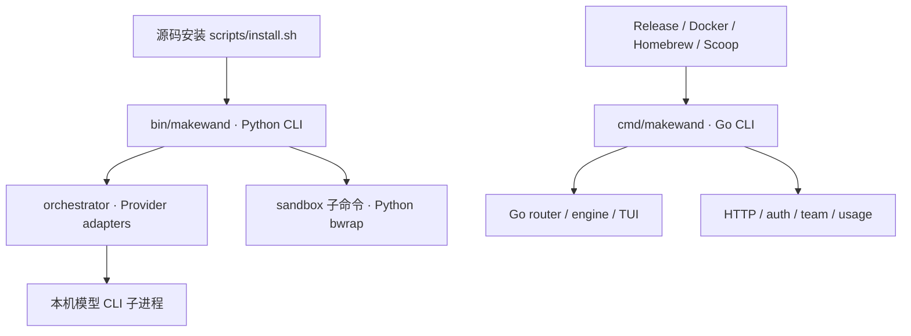

**Makewand 深度评估｜2026-09-21**

**结论：值得继续开发，当前适合受控环境中的开发者试用；默认 Python 入口尚不足以承担无人值守的可靠交付，Go 服务端也不宜按成熟多租户平台验收。**

最需要优先补齐的是执行、候选快照、验证结论、授权撤销和发布产物之间的契约。仓库已经有可复用的工程基础，尤其是 Go 路由、验证、审批和服务端持久化；但这些能力没有完整传递到 README 推荐的 Python v3 运行路径。

本评估基于 HEAD `fe19095afe34bd882e79200aae84e28cedd3ee4c`。开始时工作区干净。本次只新增评估报告，未修复生产代码。结论来自当前源码、现有测试及临时目录中的受控复现；历史评估只用于了解背景，不作为当前缺陷仍存在的证据。

**评估范围与证据边界**

覆盖 Python CLI、编排、Provider、配额缓存、Git 候选、搜索、沙箱、交互入口，以及 Go 路由、执行验证、认证、团队成员、预算、远程会话、部署和发布链路。没有运行真实模型任务，没有读取真实凭据，没有验证厂商当前套餐、模型名称、模型质量或实际费用；也没有做完整 HTTP 渗透、长时间压力测试或全部平台兼容性认证。

报告中的“实测”指现有测试或本地合成数据、mock Provider、临时 SQLite、受控子进程的验证。“静态确认”指从当前调用路径可以确定。“产品判断”是基于这些证据的成熟度判断。P1 表示对应功能对外可靠使用前应修复；P2 表示明显影响可靠性、可用性或维护性的缺陷。这里不使用未经证明的远程零点击或数据泄漏表述。

| 验证 | 当前结果 | 边界 |
| --- | --- | --- |
| `python3 -m unittest discover tests -v` | 23/23 通过 | 大量是分类、解析与 mock 路由；通过不代表真实 CLI 契约成立 |
| `go test ./... -count=1` | 21 个有测试包全部通过，另 7 包无测试 | 初次运行被环境的本地监听限制阻断；允许回环监听后全量通过 |
| `go vet ./...` | 通过 | 静态检查不验证业务授权与事务不变量 |
| 核心 Go 包 `-race` | router、engine、remotesession、serverauth、serverteam、serverusage 全部通过 | 不证明预算检查与结算构成原子事务，也不覆盖跨进程文件竞争 |
| `MAKEWAND_REQUIRE_BWRAP=1` 的 Go live isolation test | 实际执行通过，未 skip | 仅覆盖现有测试检查的隔离属性 |
| Go CLI 编译及两种入口 `--help` | 通过；命令集明显不同 | 未进行真实模型端到端验收 |
| 受控负向复现 | 确认下文门禁、基线、授权、预算、缓存及进程问题 | 均未访问真实模型或真实秘密 |

统计仅包含 Git 跟踪源码：Go 生产代码 123 文件、40,038 行，测试 125 文件、25,358 行；Python 生产代码 17 文件、2,640 行，测试 6 文件、376 行。行数不是覆盖率，但说明主要工程资产和目前默认入口的测试投入存在明显落差。

**产品价值与真实能力**

复用已配置的 CLI、统一入口、失败切换、交叉审查和收集候选实现，确实能减少开发者在工具之间切换的工作。已有 Go 引擎还提供候选克隆、基线测试保护、验证强度和审批策略，具备发展成可靠执行平台的基础。

当前需要收紧的产品承诺：

| 对外能力 | 当前实现与判断 |
| --- | --- |
| 额度感知 | Python 主要依赖错误文本和本地状态缓存；Go 有更完整的 quota snapshot、软排序、硬封锁和熔断。不能把两者合并描述为同一套能力 |
| 独立跨模型审查 | 常规路径有实现者/审查者分工；AGY 兜底及修复者切换时没有维持严格独立性，且输入会截断 |
| 自动修复闭环 | 存在有限轮数和失败门禁，但接受无效审查结果，未由 Python 编排器独立执行可信测试验收 |
| 并发竞速 | 能并发运行两份目录并让模型比较；没有可靠基线和客观验收，候选结束即删除，没有稳定的 inspect/apply 交付流程 |
| 只读安全隔离 | Provider 行为不统一，部分仅依靠提示词或去掉 bypass 参数；外部进程沙箱未统一接入 |
| 零额外 Token 计费 | 代码没有认证/计费通道的强制约束，也未形成完整成本核验；Go 还明确支持 API 模式。应描述为“可复用既有订阅 CLI” |
| 动态模型发现 | `discovery.py` 主要读取本地配置与历史记录，并包含静态默认值；不能证明模型当前可用或实际执行使用了该版本 |
| 跨会话观测 | 是有用的本机诊断原型，但硬编码工作区、以终端文本推断死锁，没有持续时序证据，不能视为通用监控系统 |

来源：[README](../README.md)、[编排器](../makewand/orchestrator.py)、[模型发现](../makewand/discovery.py)、[observer](../makewand/observer.py)、[Go quota gate](../router/quota_gate.go)。本报告不判断厂商宣传名称是否真实，仅判断代码能否兑现自身保证。

**架构：两套同名产品尚未收敛**

实际调用路径如下：



Python `run/review/race` 不经过 Go 的审批及验证引擎；单独存在 `sandbox` 子命令不能使其余路径自动获得保护。Go 的 `serve/setup/new/chat/--approval/--repo-trust` 与 Python 的 `run/review/race/observe` 也不是同一个命令契约。用户安装渠道不同，会得到不同的能力、安全默认值和故障处理方式。

建议保留两种语言各自的价值，但确立一个对外产品契约：一个主入口、一个版本体系、一个执行策略后端、一个运行记录和候选格式。Python 可以继续承担交互及编排；Go 可承担进程监督、快照、验证、预算、审批及状态持久化。是否合并语言不重要，必须消除安全策略重复实现与能力漂移。

**已经做对的部分**

- Go 具备实质性的工程积累：熔断器有半开单探针保护；配额区分预测余量与确认耗尽；验证默认要求隔离，宿主执行还需授权确认。
- Go 候选处理会合并实际文件变动，暴露删除，保留基线测试并恢复既有 npm 测试脚本；自动应用门槛区分“可构建”和“基线测试通过”。见 [candidate_service.go](../internal/engine/candidate_service.go#L63)、[workspace_verify.go](../internal/engine/workspace_verify.go#L183)。
- SQLite 使用 WAL，并为每条连接设置 foreign key 和 busy timeout；令牌按哈希存储，签发/撤销有串行更新缓存机制。见 [sqlite.go](../serverdb/sqlite.go#L22)、[sqlite_store.go](../serverauth/sqlite_store.go#L307)。
- 部署默认非 root，Compose 仅发布宿主回环端口；发布定义包含校验和、签名、构建溯源及多平台产物。这些是值得保留的基础设施。
- 最近的 Python 修复有效：非阻塞流式读取、进程组终止、随机 Race 目录和 finally 清理、缓存原子替换、总预算初步约束、review Provider 明确全失败时拒绝交付、未解决缺陷返回失败，均已在当前代码体现。

因此不能再用“完全没有超时”“Race 固定目录互删”“编码流水线 reviewer 全失败仍成功”等旧结论描述当前版本。以下问题是这些修复之后仍存在的边界缺口。

**优先问题 1｜P1：无效审查结果被当作审核通过〔实测〕**

位置：[orchestrator.py:44](../makewand/orchestrator.py#L44)、[orchestrator.py:442](../makewand/orchestrator.py#L442)、[orchestrator.py:524](../makewand/orchestrator.py#L524)。

门禁只拒绝 `None`。空字符串进入最后的成功分支；没有明确通过结论的文字，如果没有命中缺陷词，也视为通过；JSON 的 `pass` 用 `bool()` 转换，字符串 `"false"` 被当成真。

受控 reviewer 返回下列三种结果，pipeline 均返回 True：

```text
""
Unable to review. Please try again.
MAKEWAND_VERDICT: {"pass":"false","defects":["security bug"]}
```

影响：模型退出码为 0，并不意味着审查完成，当前却足以触发“通过红队审查”的成功报告。Python 流水线又没有独立的 build/test 验收，进一步放大这一错误。

改进：严格校验 schema，`pass` 只能是布尔值；结果缺失、格式错误、与 findings 矛盾都应为 UNVERIFIED。用 `PASSED / FAILED / UNVERIFIED / CANCELLED / BUDGET_EXHAUSTED` 代替仅靠布尔值和打印文字判断结果；机器验证证据应绑定精确候选快照。

**优先问题 2｜P1：非 Git 基线失真，删除文件可以完全漏审〔实测〕**

位置：[git_helper.py:42](../makewand/git_helper.py#L42)、[git_helper.py:55](../makewand/git_helper.py#L55)、[orchestrator.py:397](../makewand/orchestrator.py#L397)。

所谓“影子 Git”实际上直接在工作目录初始化 Git 并执行 `git add -N`，没有保存执行前的文件内容。Race 副本排除原 `.git` 后也使用相同逻辑。

复现：副本完全不修改，原有文件出现在新增 diff；删除唯一原文件，diff 为空。在非 Git 项目中 mock 编码器删除唯一文件，pipeline 返回 True，review 调用次数为 0。Git 提取错误也没有被可靠地区分为失败。

影响：无法证明审查覆盖了本次变更；真实文件已经被修改，所谓“拒绝交付”也没有候选回滚或原工作区保护。已有 Git 仓库还会混入用户事先的 dirty/staged 改动，并由审查读取路径改变 index。

改进：执行前冻结 BaseSnapshot，执行后独立扫描 CandidateSnapshot，比较增加、修改、删除、权限和链接；真实工作区应用前检查基线是否变化。需要 Git diff 时使用隔离 metadata，不依赖可变化的 HEAD 或用户 index。

**优先问题 3｜P1：Python 默认代码执行绕过权限，readonly 也不是统一的强制边界〔静态确认〕**

位置：[codex.py:40](../makewand/providers/codex.py#L40)、[claude.py:40](../makewand/providers/claude.py#L40)、[agy.py:29](../makewand/providers/agy.py#L29)、[muse.py:38](../makewand/providers/muse.py#L38)。

代码模式直接向 Provider 添加危险 bypass/yolo，随后调用普通 subprocess；没有外部沙箱或 Go 审批层。改变 cwd 和复制目录不限制子进程访问宿主其它路径。

readonly 模式下，Codex 使用只读 sandbox 参数，Claude 限制工具；AGY 主要增加“禁止写操作”提示词，Muse 主要省略 yolo。后两者不足以从 Makewand 自身代码证明只读属性。这里没有声称已通过真实 CLI 绕过前两者，而是确认四个 Provider 不具备同一执行契约。

改进：为每种执行阶段声明并验证读写范围、凭据、网络、工具与资源能力；只读路径必须有可测试的强制约束。默认编码在独立候选中运行；只有外部隔离策略成立时才考虑内部自动批准。

**优先问题 4｜P1：Go 登录令牌不随账号权限变更失效，旧管理员可恢复自己〔实测〕**

位置：[users.go:551](../router/users.go#L551)、[sqlite_store.go:278](../serverauth/sqlite_store.go#L278)、[handler.go:441](../serveradmin/handler.go#L441)。

登录签发 24 小时 bearer；后续认证检查 token 的 revoked/expiry，没有复核关联用户的当前状态或角色。改密、停用、降权只修改用户记录。

受控临时 SQLite 与真实 HTTP handler 验证：改密、降为 member、停用均返回 200；原管理员 bearer 随后访问管理接口仍为 200，还能对自身调用 activate 和设置 role=admin，均成功。影响不限于短期保留旧只读权限，而是可以撤销管理员的停用/降权决定。

改进：用户绑定 token 校验账户活动状态及授权版本；敏感账户变更时事务性撤销关联 token，或统一校验 auth epoch。浏览器 session 已有账户状态复核，应统一 cookie 与 bearer 的生命周期策略。

**优先问题 5｜P1：组织/项目成员停用被强制改回启用〔实测〕**

位置：[team.go:366](../serverteam/team.go#L366)、[team.go:392](../serverteam/team.go#L392)。

两个 normalize 函数均将 `IsActive == false` 改为 true。管理员向组织及项目 membership API 提交 `is_active:false`，实际响应均为 201 且 `is_active:true`。这是存储值错误，不仅是令牌缓存未刷新。

改进：在请求解码层区分“缺省”和“显式 false”，缺省值只在创建语义中处理；存储层保留业务指定值。补充成员停用、持久化读取、再登录和持有旧 token 的完整授权测试。

**优先问题 6｜P1：令牌费用预算不能约束并发在途请求〔实测〕**

位置：[http.go:1098](../router/http.go#L1098)、[http.go:1003](../router/http.go#L1003)、[auth.go:505](../serverauth/auth.go#L505)。

预算在请求前检查已结算费用，请求后才记录实际费用；这两个操作各自加锁，但没有覆盖中间执行阶段的预算预留。现有团队预算预留不保护 token 的日/月预算。

复现采用假模型计价：token 日预算 $0.10，每请求模拟费用 $0.10，同时发起 16 个请求，16 个全部进入 Provider 并返回 200，模拟总费用 $1.60；下一请求才被 429 拒绝。没有产生真实费用。即使配置预留值，只要没有组织/项目预算，该 token 缺口仍然存在。

改进：token、project、organization 使用一致的原子检查—预留—结算机制；跨实例共享预算要放到事务性存储。若只能提供软阈值，应明确显示最大在途暴露和实际费用估算边界，不能宣称硬费用上限。

**优先问题 7｜P1：Go 验证/预览沙箱未隔离宿主 PID，可向同用户宿主进程发信号〔实测〕**

位置：[verify_isolation.go:158](../internal/engine/verify_isolation.go#L158)、[preview_isolation.go:92](../internal/engine/preview_isolation.go#L92)。

两个 wrapper 使用只读根、清空环境和新 session，但没有 `--unshare-pid`。用与源码对应的 bwrap 参数，在合成沙箱内对本次测试自行启动的宿主 `sleep` 发送 SIGTERM 成功，宿主进程返回 -15。测试只操作自己的临时子进程。

影响：运行生成的测试、构建或依赖脚本时，文件写入限制不能保证同用户其它任务的进程安全。现有 live isolation 测试通过与该复现并不矛盾，它们验证的是不同属性。未据此声称宿主文件系统逃逸或真实凭据泄漏。

改进：建立 PID namespace 并加入负向隔离测试；按威胁模型补充 IPC、网络及资源限制。Python bwrap 已包含 PID/IPC/UTS 隔离，这也说明两套策略各有遗漏，值得统一。

**优先问题 8｜P1：安装、发布与质量门禁未形成同一个产品闭环〔静态确认＋局部实测〕**

位置：[install.sh:15](../scripts/install.sh#L15)、[release.yml:157](../.github/workflows/release.yml#L157)、[ci.yml:25](../.github/workflows/ci.yml#L25)、[Makefile:8](../Makefile#L8)。

- 安装器链接到源码中的 Python 文件，Release 和 Docker 构建 Go 二进制；两种入口 `--help` 的差异已实际验证。
- `make test` 仅跑 Python；CI 和 release 的测试脚本以 Go 为中心，没有 Python 测试步骤。默认产品的缺陷可能绕过发布门禁。
- CI 的文档路径检查会匹配当前 README 第 62 行的本机绝对路径并退出 1。该结论来自本地复现相同匹配条件，没有声称查询过线上 Actions。
- Release notes 推荐 `curl .../install.sh | bash`，当前安装器却依赖 `BASH_SOURCE[0]` 推导本地仓库位置，不下载版本产物。仅执行前五行的无写入复现中，stdin 运行产生 unbound variable，且在 `/tmp` 推导出源根 `/`。这条安装说明不适用于当前安装器。
- 源码安装是可变目录软链接；发布说明又从 master 获取脚本，无法保证用户取得与 tag 对应的同一行为。Python 入口也缺少对应的 `--version` 契约。

改进：明确主入口和渠道，所有安装方式遵守一致版本/能力契约；测试安装后的产物；将 Python、Go、真实适配器契约和 release contract 纳入统一门禁。文档中的 `make prelaunch` 也需要与当前 Makefile 对齐。

**其它确认问题与成熟度限制**

| 等级 | 问题与证据 | 影响及改进方向 |
| --- | --- | --- |
| P2 | `run_review()` 失败只打印文字；`run_pipeline()` 的 review 分支无条件返回 True，CLI review 不传播失败退出码。实测两 reviewer 全失败仍得到 True。见 [orchestrator.py:306](../makewand/orchestrator.py#L306)、[cli.py:301](../makewand/cli.py#L301) | 上层脚本误判成功；统一结构化结果及退出码 |
| P2 | 缓存只锁保存整个旧快照，未锁读改写事务。实测两个读者分别更新 Claude/Codex，后写使 Claude limited 回到 unknown。见 [health.py:111](../makewand/health.py#L111) | 原子 replace 防止半写，不能防止丢更新；锁内重读、按字段合并或事务 upsert |
| P2 | reset 推到翌日后仍落入“今天”比较。固定 16:00、记录更新 15:00、reset 10AM，错误判已恢复；带时区的已过期 ISO 又返回 False。见 [health.py:30](../makewand/health.py#L30) | 过早或过晚恢复；统一 aware UTC 时间，解析结果只比较一次 |
| P2 | Auto-Fix fallback 复用旧 timeout。虚拟时钟中总预算 30 秒，三个修复各获剩余 28 秒，合计 86 秒。见 [orchestrator.py:451](../makewand/orchestrator.py#L451) | 每次尝试前重算同一个 monotonic deadline；覆盖探活、快照和复审 |
| P2 | Python 进程组取消无法清理主动 setsid 的子孙。受控 stream/非 stream 均在 0.2 秒超时后，逃离进程组的子孙仍在 0.6 秒写临时标记。见 [base.py:20](../makewand/providers/base.py#L20) | 超时后仍可有副作用；将“整个进程树”保证收紧，使用 PID namespace/cgroup 等更完整的生命周期边界 |
| P2 | 非流式 `communicate()` 没有 10MB 限制。实测捕获 11,534,336 字节，超过常量 10,485,760。见 [base.py:83](../makewand/providers/base.py#L83) | 大输出仍可扩大内存；流式/非流式共用有界输出监督器 |
| P2 | search 仅用不跟随链接的 stat 检查大小，open 却跟随文件链接；受控搜索能返回工作区外合成文本，遇到 FIFO 挂起。见 [search.py:72](../makewand/search.py#L72) | 校验 regular file、链接边界及实际读字节，增加总文件数/时间/正则预算 |
| P2 | 远程 session 使用固定 `.tmp`。64 次并发保存同一 workspace 的本次复现中 63 次报错。见 [store.go:60](../internal/remotesession/store.go#L60) | 唯一临时文件＋原子替换；用版本/ETag解决覆盖。未观察到内容损坏，不将其记为已证实的数据损坏 |
| P2 | Go preview 先 bind workspace 后 tmpfs `/tmp`。受控 `/tmp` 工作区被遮蔽而启动失败。见 [preview_isolation.go:101](../internal/engine/preview_isolation.go#L101) | 统一 mount 顺序，覆盖临时目录工作区 |
| 产品限制 | Python reviewer 只收到前 4500/6000 字符，Race 每方 3000；裁判知道 Provider 身份，AGY 可能同时实现和审查，修复 fallback 后 reviewer 未重选 | 不能称严格盲审或完整覆盖；冻结候选、匿名标签、分块审查、覆盖清单、确定性验收 |
| 产品限制 | Race 在 finally 删除两份候选，只输出分析；普通 pipeline 写入原目录，无事务应用和冲突检测 | 提供 run ID、持久候选、inspect/apply/discard；失败候选不得混入下一轮隐式基线 |
| 产品限制 | 复制只排除少量顶层目录，递归 copy 无完整预算、可解引用内部 symlink，错误被吞。见 [git_helper.py:61](../makewand/git_helper.py#L61) | 大仓库可能成本失控、候选不完整；采用有预算的快照器并拒绝静默缺文件 |

**交互、性能与可维护性判断**

Python REPL 简洁，中文提示和直接自然语言输入降低了上手成本，但关键词分类会误导实际动作。本次直接调用分类器：`实现一个登录接口并审查代码` 被分类为 review，`修复 review 页面按钮` 也被分类为 review；`添加搜索功能`、`帮我完善登录功能` 被分类为 explain。即使输入 `run`，仍可能被重新降为只读解释。见 [orchestrator.py:151](../makewand/orchestrator.py#L151)。建议明确动作模式，分类只做建议，不能无声替换用户显式动作。

REPL 每轮只把当前输入传给新 pipeline，readline 历史不等于模型对话上下文。对“继续上一方案”的期望，需要持久会话、候选和决策记录支持。错误结果也应携带结构化状态，避免终端上看似完成，自动化却无法判断。

性能最大的未知来自模型调用数量、失败重试、全量复制和输出处理，当前没有可信的端到端延迟或完成率基准。Race 增加并行负载和模型调用，仍需额外裁判；是否减少用户等待和返工，必须测量。Python 总预算使用 wall clock，复制/Git 路径也没有统一计入硬 deadline。

维护方面，两套 Provider、quota、隔离、会话、模式和错误语义形成重复负担；Go 也存在较大的 HTTP/TUI/CLI 文件，后续宜围绕清晰的策略接口拆分。无需因代码行数大而重写，应先统一运行记录、授权、候选和验证结果这些稳定边界。

observer 硬编码工作区名称、路径、特定锁文件与负载阈值，并从终端出现 running 等文字推断挂死；没有持续 10 分钟的时间序列来支持相关判断。它适合保留为本机可配置诊断辅助，暂不宜把其结论当自动停止任务的依据。

**测试和评估体系的关键缺口**

已有 Go 测试是明显优点，当前全量与 race 通过也说明不应把项目评价成“不可编译的壳”。问题在于测试保护的具体不变量不足：账号变更与已签发令牌之间、预算准入与结算之间、任务前后快照之间，均跨越了多个函数或阶段。

建议优先补充能检出真实故障的端到端负向测试：无效/空 verdict 必须 UNVERIFIED；删除唯一文件仍纳入 diff；review 全失败返回非零；用户停用/降权后旧 bearer 立即拒绝；显式成员停用可持久化；并发预算不得无限放大在途费用；超时后所有受管后代停止；沙箱不能向宿主同用户进程发信号；双进程缓存和同 session 保存不丢更新。

Python 还缺少真实 CLI 的版本化契约测试，mock 确认“传了 readonly=True”不能证明底层 CLI 执行了相应限制。适配器测试应在受控环境验证参数是否被接受、cwd、只读属性、退出码、quota 信号、流式输出和取消；真实模型质量基准应单独运行并记录花费。

本地 `benchmarks` 有探索素材，但 Git 仅跟踪 README、run.sh 和 results/go.mod。prompts 与 score.sh 被忽略；run.sh 对 Makewand 主要打印手工操作指引，仍针对旧 Go `new --mode`。因此当前仓库不能向新的贡献者交付一套完整、自动、可重复的 Python v3 效果比较。不能从 README 的预期排名或模型裁判文字推导出多模型已优于直接使用单模型。

建议建立同任务、同模型版本、同调用/时间预算的对照：直接单 Agent、单 Agent＋确定性验证、跨模型审查修复、Race。每种多次重复，预先固定验收测试；报告首次通过率、修复后通过率、回归率、人工返工时间、p50/p95 延迟、调用数量和实际计费来源。缺少这一步，新增编排复杂度的净收益仍是待验证假设。

**建议的实施顺序与验收标准**

| 阶段 | 工作 | 完成标准 |
| --- | --- | --- |
| 1：修复可靠使用的阻断项 | 严格审查 schema、真实任务基线、默认执行权限；令牌撤销、成员 false、token 预算预留；修复 Go PID 边界 | 上述负向复现全部转为回归测试并通过；真实工作区在验收前不受候选写入影响 |
| 2：统一交付契约 | 选定主入口；统一状态、退出码、版本、安装渠道；修复 CI 文档门禁；覆盖 Python 与 Go 安装产物 | 同版本所有渠道具有声明一致的命令/能力；安装后 smoke test 可重复通过 |
| 3：完成可靠单 Agent 闭环 | run ID、不可变候选、基线验收、一次有界修复、inspect/apply/discard、工作区冲突检测 | 能演示执行失败、取消、预算耗尽、测试失败和工作区并发变化时不错误交付 |
| 4：修复稳定性边界 | 缓存事务、UTC reset、全局 deadline、进程生命周期、有界快照/search、远程 session 并发 | 故障注入、并发及大目录测试均有明确上限和结果状态 |
| 5：证明编排收益 | 可重复对照基准，记录完成率、返工、延迟和资源消耗 | 实测收益足以覆盖多模型带来的时间、额度和维护成本，再扩大 Race/自动组队 |

仓库已有 [AI_ORCHESTRATION_MVP.md](AI_ORCHESTRATION_MVP.md) 提出的快照、可信验证、候选应用与停止条件，方向与当前缺口高度一致。建议将这些变为可验收的实现任务，优先形成一条可靠闭环，再扩大模型数量和部署范围。

**使用定位**

| 场景 | 当前判断 |
| --- | --- |
| 自己维护的可信仓库、有备份且有人查看结果 | 可作为实验工具试用，建议在专用环境/候选副本中运行 |
| 无人值守修改重要仓库 | 当前不推荐；质量门禁、候选基线和执行权限未闭环 |
| 个人回环/隧道 Go 服务 | 有可用工程基础，仍需关注授权与预算缺陷 |
| 多用户、多租户服务 | 应先修复身份生命周期、成员停用、预算与会话并发 |
| 宣称比单模型更高质量/更低总成本 | 现有可重复证据不足，需要新的对照评估 |

**本次验证记录**

完整测试命令：

```bash
python3 -m unittest discover tests -v
go test ./... -count=1
go vet ./...
go test -race ./router ./internal/engine ./internal/remotesession ./serverauth ./serverteam ./serverusage -count=1
MAKEWAND_REQUIRE_BWRAP=1 go test ./internal/engine -run '^TestEvaluateCandidateFiles_LiveBwrapIsolation$' -count=1 -v
go build -trimpath -o /tmp/makewand-eval-bin ./cmd/makewand
```

临时日志：`/tmp/makewand-eval-python.log`、`/tmp/makewand-eval-go-unrestricted.log`、`/tmp/makewand-eval-vet.log`、`/tmp/makewand-eval-race.log`、`/tmp/makewand-eval-live-sandbox.log`。

受控复现材料：`/tmp/makewand_python_correctness_audit.py`、`/tmp/makewand_backend_review.go`、`/tmp/makewand_budget_review.go`、`/tmp/makewand_session_review_test.go`、`/tmp/makewand_review_overlay.json`、`/tmp/makewand_execution_audit.py`、`/tmp/makewand_execution_audit.json`。它们是本次环境中的辅助证据，不是仓库永久测试；关键触发条件、输出和源码位置已写入本报告。
